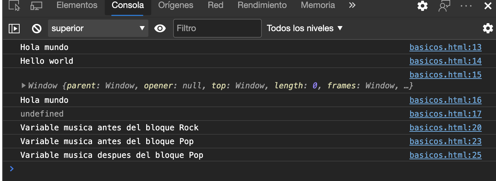
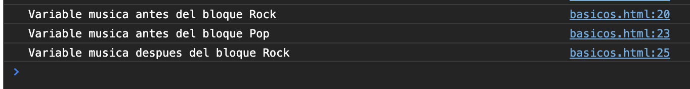

# Javascript

## Introducción

Lenguaje de programación interpretado, creado por [Brendan Eich](https://es.wikipedia.org/wiki/Brendan_Eich)

| Edición | Publicación | Cambios                                                                                                                                                                                                                                                                                                                                                                                                                                                                                                 |
| :-----: | :---------: | :------------------------------------------------------------------------------------------------------------------------------------------------------------------------------------------------------------------------------------------------------------------------------------------------------------------------------------------------------------------------------------------------------------------------------------------------------------------------------------------------------ |
|    1    |    1997     | Primera edición.                                                                                                                                                                                                                                                                                                                                                                                                                                                                                        |
|    2    |    1998     | Cambios editoriales para mantener la especificación completa alineada con el estándar internacional ISO/IEC 16262.                                                                                                                                                                                                                                                                                                                                                                                      |
|    3    |    1999     | Se agregaron expresiones regulares, mejor manejo de strings, nuevo control de declaraciones, manejo de excepciones con try/catch, definición mas estricta de errores, formato para la salida numérica y otras mejoras.                                                                                                                                                                                                                                                                                  |
|    4    | Abandonado  | La cuarta edición fue abandonada debido a diferencias políticas respecto a la complejidad del lenguaje. Muchas características propuestas para la cuarta edición fueron completamente abandonadas; algunas fueron propuestas para la edición ECMAScript Harmony.                                                                                                                                                                                                                                        |
|    5    |    2009     | Agrega el modo **string mode** , un subconjunto destinado a proporcionar una mejor comprobación de errores y evitar constructores propensos a errores. Aclara varias ambigüedades de la tercera edición, y afina el comportamiento de las implementaciones del "mundo real" que difieren consistentemente desde esa especificación. Agrega algunas nuevas características, como getters y setters, librería para el soporte de JSON, y una mas completa reflexión sobre las propiedades de los objetos. |
|   5.1   |    2011     | Está completamente alineada con la tercera edición del estándar internacional ISO/IEC 16262:2011.                                                                                                                                                                                                                                                                                                                                                                                                       |
|         |             | A partir de 2015 las actualizaciones son continuas teniendo una versión anual.                                                                                                                                                                                                                                                                                                                                                                                                                          |
|    6    |    2015     | ES2015 es ES6.                                                                                                                                                                                                                                                                                                                                                                                                                                                                                          |
|    7    |    2016     | ES2016 es ES7.                                                                                                                                                                                                                                                                                                                                                                                                                                                                                          |
|    8    |    2017     | ES2017 es ES8.                                                                                                                                                                                                                                                                                                                                                                                                                                                                                          |
|    9    |    2018     | ES2018 es ES9.                                                                                                                                                                                                                                                                                                                                                                                                                                                                                          |
|   10    |    2019     | ES2019 es ES10.                                                                                                                                                                                                                                                                                                                                                                                                                                                                                         |
| ESNext  |             | ...y así sucesivamente                                                                                                                                                                                                                                                                                                                                                                                                                                                                                  |

## Características y gramática

### Isomorfismo

Hoy(2020) Javascript es el único lenguaje capaz de ejecutarse en las 3 capas de una aplicaión:

1. Frontend(Javascript).
2. Backend(Node.js).
3. Persistencia de Datos(MongoDB, Couch DB, Firebase, etc).

### Que se puede hacer con Javascript?

- Diseño y desarrollo web.
- Videojuegos.
- Experiencias 3D, Realidad Aumentada, Realidad Virtual.
- Controlar hardware(Drones, Robots, Electrodomesticos, etc).
- Aplicaciones Móviles e Híbridas.
- Machine Learning y otras IAs.

### Características

- Lenguaje de Alto Nivel.
- Interpretado.
- Dinámico.
- Débilmente Tipado.
- Multi paradigma.
- Distingue MAYÚSCULAS y minúsculas.
- No necesita los puntos y comas al final de cada linea.

### Escribiendo código

Los [**identificadores**](# "Funciones, Variables, Clases, etc") deben comenzar con:

- Una letra o
- Un signo de dolar **\$** o
- Un guión bajo **\_**
- Nunca números o caracteres especiales

### Palabras reservadas

Son las palabras que ya estan siendo utilizadas por los lenguajes de programacion y no deberiamos de usar para crear identificadores con esos nombres.

```javascript
A: abstract;
B: bolean, break, byte;
C: case, catch char, class, const , continue;
D: debugger, default, delete, do, double;
E: else, enum, export, extends;
F: false, final, finally, float, for, function;
G: goto;
I: if, implements, import, in, instanceof, int, interface;
L: long;
N: native, new, null;
P: package, private, protected, public;
R: return,
S: short, static, super, switch, synchronized;
T: this, throw, throws, transient, true, try, typeof;
V: var, volatile, void;
W: while, with;
```

### Orden del código

Para mejores practicas al escribir código debemos seguir el siguiente orden.

1. Importación de módulos.
2. Declaración de variables.
3. Declaración de funciones.
4. Ejecución de código.

### Tipos de datos

1. **Primitivos**(Se accede directamente al valor).

   - string
   - number
   - boolean
   - null
   - undefined
   - NaN

2. **Compuestos**(Se accede a la referencia del valor).

   - object = {}
   - array = []
   - function = () {}
   - class {}
   - etc.

### Comentarios

Son para que el desarrollador deje notas dentro del código y sea mas sencillo de entender en futuras revisiones o modificaciones del codigo.

```javascript
//Comentario de una linea
```

```javascript
/*Comentario
de
múltiples 
lineas*/
```

## Variables

**var vs let**

```html
<script>
  var hola = "Hola mundo";
  let hello = "Hello world";
  console.log(hola);
  console.log(hello);
  console.log(window);
  console.log(window.hola);
  console.log(window.hello);
  //bloque
  var musica = "Rock";
  console.log("Variable musica antes del bloque", musica);
  {
    var musica = "Pop";
    console.log("Variable musica antes del bloque", musica);
  }
  console.log("Variable musica despues del bloque", musica);
</script>
```

Si escribimos el codigo anterior en un html y visualizamos la pagina al revisar la consola veeremos lo siguiente:



Quiere decir que var tiene un alcance global y se guarda dentro del objeto window(que es toda la ventana del navegador), en node se guardaría dentro del objeto "global".

Pero que pasa si el codigo anterior cambiamos var a let?

```javascript
//bloque
let musica = "Rock";
console.log("Variable musica antes del bloque", musica);
{
  let musica = "Pop";
  console.log("Variable musica antes del bloque", musica);
}
console.log("Variable musica despues del bloque", musica);
```

Observamos la consola



Y podemos ver que let si nos respeta cuando lo llamamos dentro de un bloque y fuera de este.
